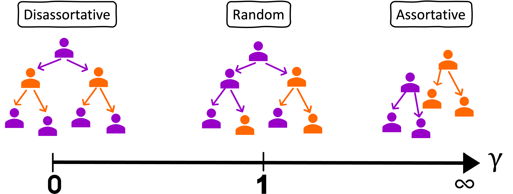
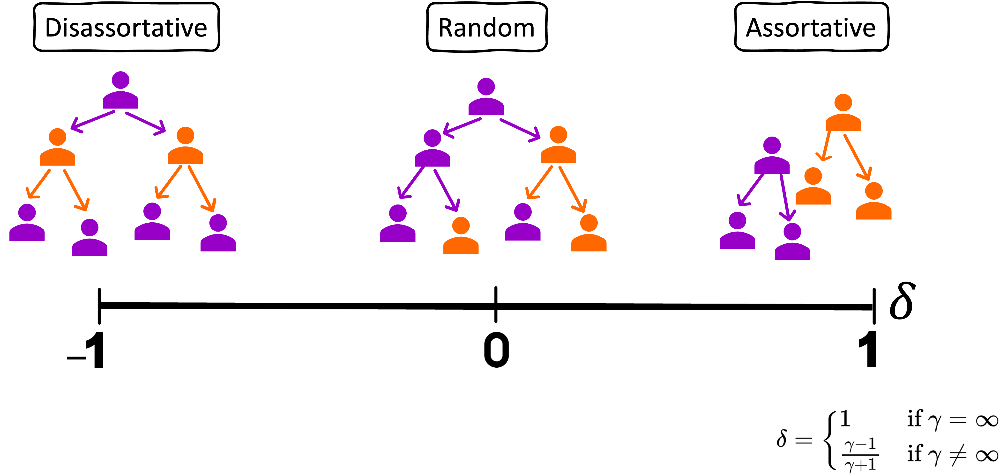

<!-- README.md is generated from README.Rmd. Please edit that file -->

```{r, include = FALSE}
knitr::opts_chunk$set(
  collapse = TRUE,
  comment = "#>",
  fig.path = "man/figures/README-",
  out.width = "100%"
)
```

# linktree <a href="https://cygei.github.io/linktree/"></a>

<!-- badges: start -->
[](https://www.codefactor.io/repository/github/cygei/linktree)
[](https://github.com/CyGei/linktree/actions/workflows/R-CMD-check.yaml)

<!-- badges: end -->

`linktree` is a novel framework that estimates ***group transmission assortativity*** from transmission trees.

## Installation

You can install the development version of linktree from [GitHub](https://github.com/) with:

``` r
# install.packages("pak")
pak::pak("CyGei/linktree")
```

```{r library}
library(linktree)
```

## Definition

Group transmission assortativity quantifies the extent to which individuals transmit within their own group compared to others. The methodology is described in our [paper](https://journals.plos.org/plosone/article?id=10.1371/journal.pone.0313037), and briefly discussed on [YouTube](https://www.youtube.com/watch?v=Ib5dBunDPN0).

The $\gamma$ coefficient ranges from 0 to $\infty$. It describes the excess propability of transmitting within your own group versus other groups. See `get_gamma()`.



We can rescale $\gamma$ to the $\delta$ coefficient, which ranges from -1 to 1 using `get_delta()`.



## Documentation
`linktree` requires that you have transmission chain data (*i.e.* who infected whom) and group membership for each individual in the transmission chain.

For more information, check the dedicated [vignette](https://cygei.github.io/linktree/articles/linktree.html).