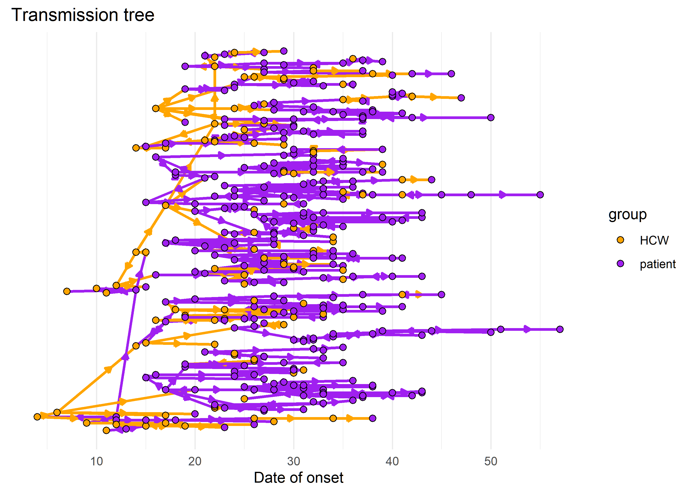
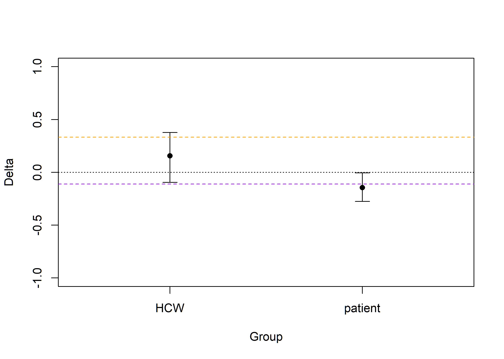

<!-- README.md is generated from README.Rmd. Please edit that file -->

# linktree: untangling links between groups in your transmission tree

<!-- badges: start -->
<!-- badges: end -->

`Linktree` assesses the group's transmission **link**s from the transmission **tree**. Its goal is to estimate the *transmission assortativity coefficient*, quantifying the tendency of transmission to occur within a given group versus other groups.

## Installation

You can install the development version of linktree from
[GitHub](https://github.com/) with:

``` r
# install.packages("devtools")
devtools::install_github("CyGei/linktree")
```

## Example

This is a basic example which shows you how to solve a common problem:

``` r
library(linktree)
#> 
#> Attaching package: 'linktree'
#> The following object is masked from 'package:base':
#> 
#>     gamma
# Transmission tree data: who infected whom?
from <- sample(c("A", "B"), 1000, replace = TRUE, prob = c(0.5, 0.5))
to <- sample(c("A", "B"), 1000, replace = TRUE, prob = c(0.5, 0.5))

#Metadata: groups and relative sizes
levels = c("A", "B")
f = c(0.5, 0.5)
```

``` r
pi_values <- pi(from, to, levels)
gamma_values <- gamma(pi_values, f)

#convert gamma to delta
gamma2delta(gamma_values)
#>           A           B 
#> -0.08764940 -0.04819277
```

Relationship between gamma and delta

``` r
gamma_values <- seq(0, 100, 0.1)
delta_values <- gamma2delta(gamma_values)
plot(gamma_values, delta_values, type = "l", xlab = "Gamma", ylab = "Delta")
```



Relationship between pi, f and delta:

``` r
grid <- expand.grid(f = seq(0.01, 0.99, 0.01), 
                    pi = seq(0, 1, 0.01))
grid$delta<- gamma2delta(
  gamma(pi = grid$pi, f = grid$f)
)

library(ggplot2)
ggplot(grid, aes(x = pi, y = f, fill = delta)) +
  geom_raster() +
  scale_fill_gradient2(
    low = "purple",
    mid = "white",
    high = "orange",
    midpoint = 0
  ) +
  theme_minimal()
```


