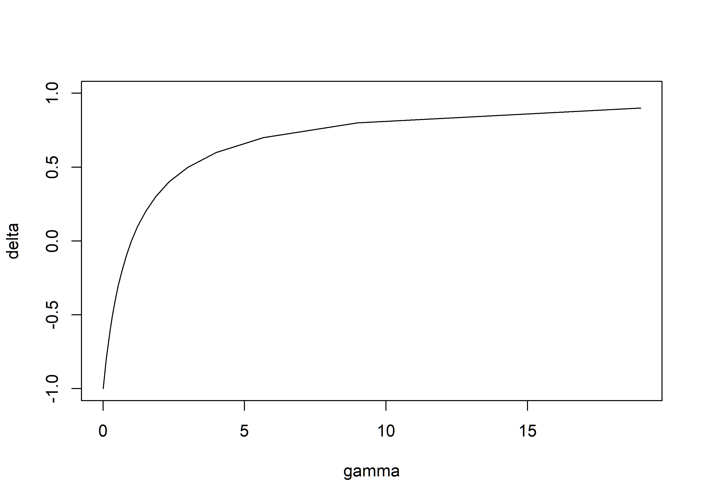
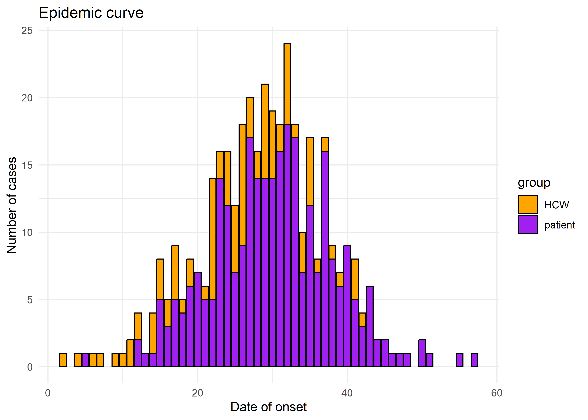

<!-- README.md is generated from README.Rmd. Please edit that file -->

# linktree

<!-- badges: start -->
<!-- badges: end -->

The goal of `linktree` is to estimate the transmission assorativity
coefficient.

## Installation

You can install the development version of linktree from
[GitHub](https://github.com/CyGei/linktree/) with:

``` r
# install.packages("devtools")
devtools::install_github("CyGei/linktree")
```

## Understanding the transmission assortativity coefficient

`linktree` leverages transmission chain data to estimate group
transmission assortativity; this quantifies the extent to which
individuals transmit within their own group compared to others.

### Gamma

$\gamma$ is defined as the excess probability of a secondary infection
taking place within-group compared to random expectation. $\gamma$
values range from 0 (fully disassortative) to $\infty$ (fully
assortative), with 1 indicating homogeneous patterns. For instance,
$\gamma_a = 2$ indicates that an infected individual from group $a$ is
twice as likely to infect an individual from the same group compared to
infecting an individual from another group.

### Delta

To simplify interpretation, we introduce a rescaled parameter $\delta$,
ranging between -1 (fully disassortative) and 1 (fully assortative),
with 0 indicating homogeneous patterns.

We can visualise the relationship between $\gamma$ and $\delta$:

``` r
library(linktree)
delta <- seq(-1, 1, 0.01)
gamma <- delta2gamma(delta)
plot(gamma, delta, type = "l")
```



### Estimation

`get_gamma` and `get_delta` estimate $\gamma$ and $\delta$ from a
transmission tree. It requires the following inputs: - `from`: a vector
of infector’s group (e.g. age group, sex, vaccination status, etc.) -
`to`: a vector of infectee’s group - `f`: a vector of the groups’ sizes
or relative sizes (e.g. proportion of the population in each group).

## Example

### Data

We can load the `simulated_tree` data from the package. It represents a
simulated transmission tree in a population with 2 groups (A & B). The
tree is stored as a data frame with 4 columns: `id`, `group`,
`date_infection` and `date_onset`. The `id` column contains the unique
identifier of each individual. The `group` column contains the group to
which each individual belongs. The `date_infection` column contains the
date of infection of each individual. The `date_onset` column contains
the date of onset of symptoms of each individual. `source` and
`source_group` are the unique identifier of the individual who infected
the individual and the group to which the source individual belongs.

Group A is assortative with a `delta` coefficient of 0.75 and group B is
neutral with a `delta` coefficient of 0. Both group sizes were set at
100 individuals. This outbreak was simulated using the package
[o2groups](https://github.com/CyGei/o2groups).

``` r
head(simulated_tree)
#>   group     id source source_group date_infection date_onset
#> 1     A IZ3LUW   <NA>         <NA>              0          1
#> 2     B oVqaXc   <NA>         <NA>              0          5
#> 3     B IZzvlq   <NA>         <NA>              0          7
#> 4     B vbMkU0   <NA>         <NA>              0          4
#> 5     A 8NtnV1 oVqaXc            B              1         11
#> 6     A QLLIuH 8NtnV1            A              3          4
```

### Visualise the transmission tree & outbreak

``` r
#devtools::install_github("reconhub/epicontacts", ref = "timeline")
library(epicontacts)
library(dplyr)
library(ggplot2)


ttree<- epicontacts::make_epicontacts(
  linelist = select(simulated_tree, c(group, id, date_infection, date_onset)),
  contacts = select(simulated_tree, c(source, id, source_group, group)),
  id = "id",
  from = "source",
  to = "id",
  directed = TRUE
)

plot(
  ttree,
  selector = FALSE,
  x_axis = "date_onset",
  method = "ggplot",
  node_color = "group",
  edge_color = "source_group"
)+
  scale_colour_manual(values = c("orange", "purple"))+
  scale_fill_manual(values = c("orange", "purple"))+
  labs(title = "Transmission tree", x = "Date of onset", y = "")
```


``` r


#Plot the epidemic curve
simulated_tree %>%
  ggplot(aes(x = date_onset)) +
  geom_bar(stat = "count", aes(fill = group)) +
  scale_fill_manual(values = c("orange", "purple")) +
  labs(title = "Epidemic curve", x = "Date of onset", y = "Number of cases")
```


### Estimate the transmission assortativity coefficient

``` r
delta <- get_delta(
  from = simulated_tree$source_group,
  to = simulated_tree$group,
  f = c(A = 100, B = 100)
)

delta
#>   group       est      lwr       upr
#> 1     A 0.5578947 0.364328 0.7153064
#> 2     B 0.4230769 0.138484 0.6574064
```

Group-level saturation (i.e. the depletion of susceptibles) can
significantly impact the estimation of the transmission assortativity
coefficient. To account for this, we should estimate the transmission
assortativity coefficient up to the epidemic peak (i.e. day 17).

``` r
cut_tree <- simulated_tree %>%
  filter(date_onset <= 17)

delta <- get_delta(
  from = cut_tree$source_group,
  to = cut_tree$group,
  f = c(A = 100, B = 100)
)
plot(delta)
```


