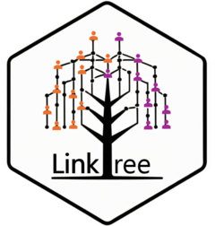

<!-- README.md is generated from README.Rmd. Please edit that file -->

# linktree <a href="https://cygei.github.io/linktree/"></a>

<!-- badges: start -->

[](https://CRAN.R-project.org/package=linktree)
[](https://CRAN.R-project.org/package=linktree)
[](https://www.codefactor.io/repository/github/cygei/linktree)
[](https://github.com/CyGei/linktree/actions/workflows/R-CMD-check.yaml)

<!-- badges: end -->

`linktree` is a novel framework that estimates ***group transmission
assortativity*** from transmission trees.

## Installation

You can install `linktree` from CRAN:

``` r
install.packages("linktree")
```

## Definition

Group transmission assortativity quantifies the extent to which
individuals transmit within their own group compared to others. The
methodology is described in our
[paper](https://journals.plos.org/plosone/article?id=10.1371/journal.pone.0313037),
and briefly discussed on
[YouTube](https://www.youtube.com/watch?v=Ib5dBunDPN0).

The $\gamma$ coefficient ranges from 0 to $\infty$. It describes the
excess propability of transmitting within your own group versus other
groups. See `get_gamma()`.

<figure>

<figcaption aria-hidden="true">gamma assortativity
coefficient</figcaption>
</figure>

We can rescale $\gamma$ to the $\delta$ coefficient, which ranges from
-1 to 1 using `get_delta()`.

<figure>

<figcaption aria-hidden="true">delta assortativity
coefficient</figcaption>
</figure>

## Documentation

`linktree` requires that you have transmission chain data (*i.e.* who
infected whom) and group membership for each individual in the
transmission chain.

For more information, check the dedicated
[vignette](https://cygei.github.io/linktree/articles/linktree.html).
